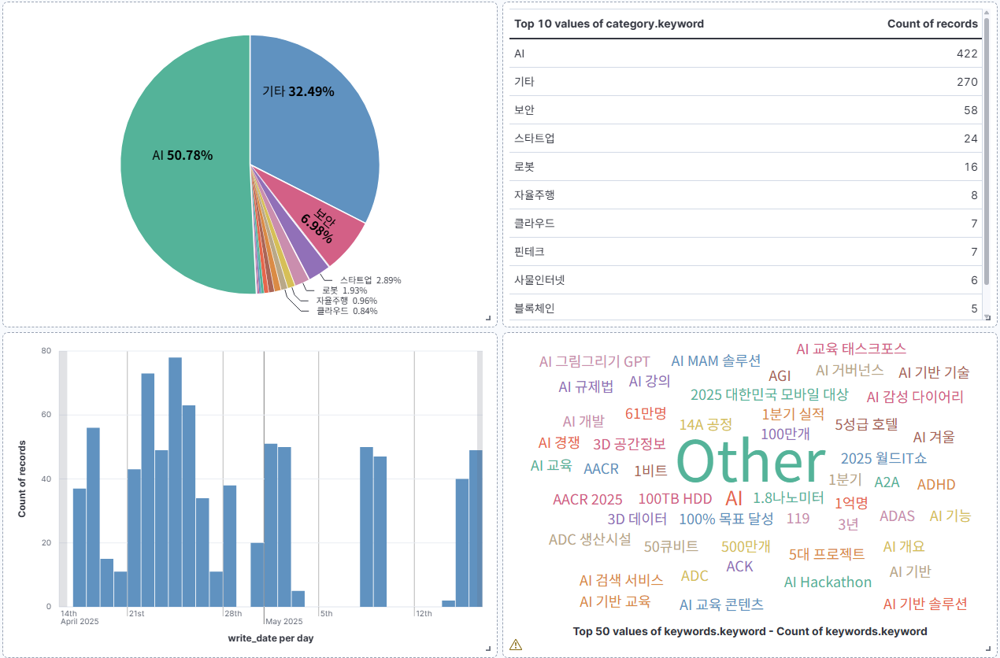

# 📰 실시간 뉴스 임베딩 기반 분석 플랫폼

## 📌 프로젝트 개요

**목표:**
실시간 뉴스 데이터를 수집하고, 텍스트 임베딩 기반으로 유사 뉴스 추천 및 인사이트 분석이 가능한 플랫폼을 구축합니다.

**핵심 키워드:**
`RSS`, `크롤링`, `pgvector`, `뉴스 임베딩`, `PostgreSQL`, `Kafka`, `Flink`, `Spark`, `Airflow`, `Elasticsearch`

## 🏗️ 전체 아키텍처


## ⚙️ 전체 구성 요소 및 역할

### ✅ Kafka Producer

* RSS 피드를 수집하고 기사 본문을 크롤링하여 Kafka Topic(`news`)에 JSON 전송
* 파일: `producer_hankyung.py`, `producer_aitimes.py`

### ✅ Flink Consumer

* Kafka 메시지를 PyFlink로 수신하여 OpenAI 전처리 후 PostgreSQL에 저장
* 주요 처리 항목: 키워드 추출, 임베딩 생성, 카테고리 분류
* 파일: `consumer.py`

### ✅ OpenAI 전처리 모듈

| 함수명                                 | 설명              |
| ----------------------------------- | --------------- |
| `transform_extract_keywords(text)`  | 키워드 5개 추출       |
| `transform_to_embedding(text)`      | 본문 임베딩 (1536차원) |
| `transform_classify_category(text)` | IT 분야 카테고리 분류   |

### ✅ PostgreSQL

* 테이블명: `news_article`
* 임베딩 벡터 저장을 위한 `pgvector` 확장 사용

```sql
CREATE TABLE news_article (
  id SERIAL PRIMARY KEY,
  title VARCHAR,
  writer VARCHAR,
  write_date TIMESTAMP,
  category VARCHAR,
  content TEXT,
  url VARCHAR UNIQUE,
  keywords JSONB,
  embedding VECTOR(1536),
  updated_at TIMESTAMP DEFAULT CURRENT_TIMESTAMP
);
```

### ✅ Elasticsearch

* 검색 엔진 역할
* `migration.py` 또는 Airflow DAG 통해 동기화

```json
"mappings": {
  "properties": {
    "title":     { "type": "text" },
    "content":   { "type": "text" },
    "writer":    { "type": "text" },
    "url":       { "type": "keyword" },
    "category":  { "type": "keyword" },
    "keywords":  { "type": "keyword" },
    "write_date":{ "type": "date" }
  }
}
```
```bash
# migration.py 실행 (초기 1회)
# PostgreSQL 주소 localhost → 192.168.210.75 수정 필요
$ python migration.py
```

### ✅ Spark (Batch 분석)

* `spark_daily_report.py`: 일별 PDF 리포트 생성 (키워드, 카테고리, 시간대 분석)

### ✅ Airflow

* DAG 구성:

  * `streaming_dag.py`: 실시간 흐름 관리용 DAG (예비)
  * `daily_report_dag.py`: Spark 기반 리포트 자동화 (매일 9시 실행)
  * `sync_postgres_to_es.py`: 10분 단위 Elasticsearch 동기화 (upsert 기반)
* 실행 위치: `/opt/airflow/dags/`

```bash
# Airflow 초기화 및 실행
$ sudo docker compose up airflow-init
$ sudo docker compose up -d

# UI 접속: http://localhost:8080 (ID/PW: airflow/airflow)
```

### ✅ Kibana


## 📂 디렉토리 구조 예시 (상위: data-pjt)

```bash
batch/
├── dags/
│   ├── daily_report_dag.py
│   ├── streaming_dag.py
│   ├── sync_postgres_to_es.py
│   └── scripts/
│       └── spark_daily_report.py
├── data/
├── logs/
├── output/
```

## 📧 이메일 전송 설정 예시 (.env)

```env
AIRFLOW__SMTP__SMTP_HOST=smtp.gmail.com
AIRFLOW__SMTP__SMTP_USER=heeju531341@gmail.com
AIRFLOW__SMTP__SMTP_PASSWORD=앱비밀번호
AIRFLOW__SMTP__SMTP_PORT=587
AIRFLOW__SMTP__SMTP_MAIL_FROM=heeju531341@gmail.com
```

## 🚀 향후 확장 계획

* pgvector 기반 유사 뉴스 추천 API (`/similar-news`)
* Full-Text 검색 및 필터링 기능
* Spark 기반 시각화 리포트 고도화
* RSS 수집 대상 언론사 및 카테고리 확장
* Kafka + Flink 장애 대응 및 자동 재시작 로직 구성
