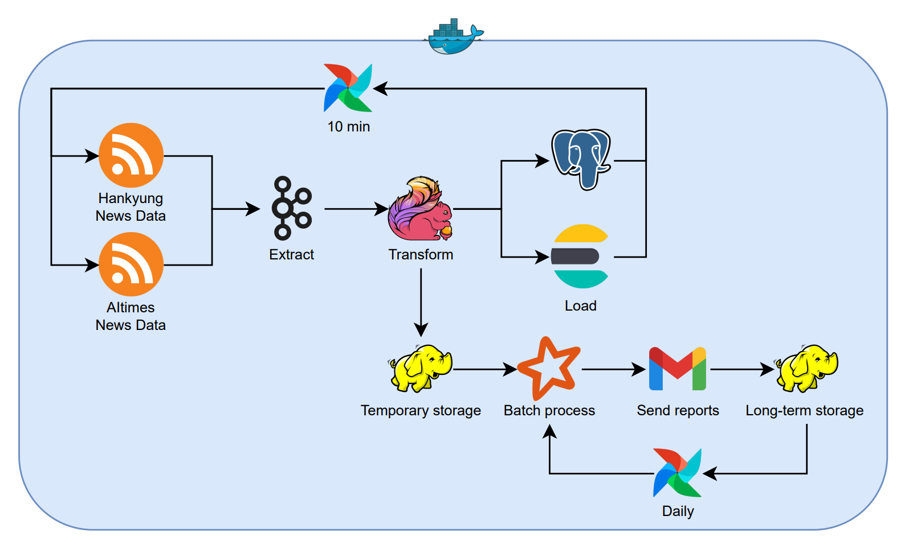

# 📰 SSAFIT NEWS - Data process
실시간 뉴스 데이터를 수집하고, 텍스트 임베딩 기반으로 유사 뉴스 추천 및 인사이트 분석이 가능한 플랫폼을 구축합니다.

## 🏗️ 전체 아키텍처


## 주요 기능
### 1. 실시간 뉴스 수집
- RSS 피드를 통한 실시간 뉴스 데이터 수집
- 한국경제, AI타임스 등 주요 언론사 데이터 수집
- 수집된 데이터는 Kafka 토픽으로 전송

### 2. 스트리밍 처리
- Kafka → Flink 기반 실시간 데이터 처리
- 뉴스 본문 전처리 및 정제
- 중복 뉴스 필터링 및 데이터 정합성 검증

### 3. 데이터 분석 및 저장
- 뉴스 키워드 추출 및 카테고리 분류
- OpenAI Embedding API를 활용한 텍스트 벡터화
- PostgreSQL(pgvector) 및 Elasticsearch 이중 저장
- 실시간 검색 및 추천 기능 지원

### 4. 리포트 생성
- Spark 기반 일간/주간 뉴스 분석
- 키워드 트렌드 및 시각화
- PDF 형식의 분석 리포트 자동 생성
- HDFS 기반 리포트 아카이빙

## 🛠️ 기술 스택

### 📥 Data Collection & Processing

 


### 📦 Storage


### 🤖 Embedding & NLP


### 🔄 Orchestration & Infrastructure


## 핵심 알고리즘

### 🔑 1. 키워드 추출
- KoNLPy 기반 형태소 분석
- 명사, 고유명사 필터링
- TF-IDF 기반 중요 키워드 선정
- 상위 N개 키워드 추출

### 📑 2. 카테고리 분류
- Rule-based Classifier 구현
- 키워드 기반 카테고리 매핑
- 다중 카테고리 분류 지원
- 카테고리별 신뢰도 점수 산출

### 🔢 3. 문서 임베딩
- OpenAI Embedding API 활용
- 뉴스 제목 + 본문 통합 임베딩
- 1536차원 벡터 생성
- pgvector 기반 유사도 검색

### 📊 4. Spark PDF 리포트 생성
- 일간/주간 뉴스 통계 분석
- 키워드 클라우드 생성
- 시간대별 뉴스량 추이 분석
- 카테고리별 분포 시각화
- matplotlib을 활용한 PDF 리포트 생성

## 개발자 역할
### 데이터 파이프라인 설계
- 전체 시스템 아키텍처 설계
- 데이터 흐름 및 저장소 설계
- 확장성 고려한 시스템 구성

### 실시간 처리 구현
- Flink 기반 스트리밍 처리 로직
- 데이터 전처리 및 정제 파이프라인
- 실시간 모니터링 시스템 구축

### 데이터 분석 및 저장
- Spark 분석 로직 구현
- Elasticsearch 색인 설계
- 벡터 검색 최적화

### 시스템 운영
- Airflow DAG 설계 및 구현
- Docker 기반 컨테이너화
- 모니터링 및 로깅 시스템 구축

## 📂 디렉토리 구조
```bash
.
├── batch/                    # 배치 처리 관련 코드
│   ├── dags/                # Airflow DAG 정의
│   │   ├── daily_report_dag.py
│   │   ├── sync_postgres_to_es.py
│   │   └── streaming_dag.py  # 실시간 뉴스 수집 DAG
│   ├── scripts/             # 실행 스크립트
│   │   ├── spark_daily_report.py
│   │   ├── consumer.py
│   │   ├── db_config.py
│   │   ├── db_utils.py
│   │   ├── models.py
│   │   ├── news_model.py
│   │   ├── preprocess.py
│   │   ├── producer_aitimes.py
│   │   ├── producer_hankyung.py
│   │   ├── producer_etnews.py 
│   │   └── config/
│   ├── data/               # 데이터 저장소
│   │   └── daily_reports/
│   ├── logs/              # 로그 파일
│   └── output/            # 출력 결과물
├── docker/                # Docker 관련 파일
│   ├── Dockerfile.airflow
│   ├── Dockerfile.spark
│   ├── Dockerfile.flink
│   ├── requirements.txt   # Python 패키지 의존성
│   ├── flink-conf.yaml    # Flink 설정 파일
│   └── flink-entrypoint.sh # Flink 실행 스크립트
├── hadoop/               # Hadoop 관련 설정 및 파일
├── img/                 # 이미지 파일 저장소
├── setup/              # 초기 설정 스크립트
├── test.py            # 테스트 스크립트
├── .env               # 환경 변수 설정
├── .gitignore        # Git 무시 파일 목록
├── docker-compose.yaml # Docker Compose 설정
└── requirements.txt    # Python 패키지 의존성
```

## 설치 및 실행

### 1. 환경 구성
```bash
# 저장소 클론
git clone https://github.com/choihjin/news-data-project.git
cd news-data-project

# 환경 변수 설정
vi .env
# 필요한 환경 변수:
# - OPENAI_API_KEY: OpenAI API 키 (텍스트 임베딩 및 분석에 사용)
# - DB_USERNAME: PostgreSQL 사용자 이름 (데이터베이스 접근용)
# - DB_PASSWORD: PostgreSQL 비밀번호 (데이터베이스 접근용)
# - POSTGRES_PORT: PostgreSQL 포트 번호 (기본값: 5432)
# - AIRFLOW_UID: Airflow 사용자 ID (기본값: 50000)
# - KAFKA_NODE_ID: Kafka 노드 식별자 (클러스터 내 고유 ID)
# - KAFKA_BROKER_PORT: Kafka 브로커 포트 (기본값: 9092)
# - KAFKA_CONTROLLER_PORT: Kafka 컨트롤러 포트 (기본값: 9093)
# - KAFKA_CLUSTER_ID: Kafka 클러스터 식별자 (클러스터 고유 ID)
# - SMTP_HOST: SMTP 서버 호스트 (이메일 알림 발송용)
# - SMTP_PORT: SMTP 서버 포트 (기본값: 587)
# - SMTP_USER: SMTP 사용자 이메일
# - SMTP_PASSWORD: SMTP 사용자 비밀번호
# - SMTP_MAIL_FROM: 발신자 이메일 주소
```

### 2. Docker 실행
```bash
# 컨테이너 빌드 및 실행
docker-compose up -d --build

# 로그 확인
docker-compose logs -f
```

### 3. DAG 실행
```bash
# Airflow 웹 UI 접속 (기본 포트: 8080)
# http://localhost:8080

# 수동 실행
airflow dags trigger daily_report_dag

# 또는 Airflow UI에서 실행
```

## 📊 모니터링 및 관리

### 🔄 워크플로우 모니터링
-  
- DAG 실행 상태 및 로그 모니터링
- DAG 실행 이력 및 성공/실패 현황
- 태스크별 실행 시간 및 리소스 사용량
- 실시간 로그 확인 및 디버깅

### 📨 메시지 큐 모니터링
-  
- Kafka 클러스터 상태 모니터링
- 토픽별 메시지 처리량 및 지연 현황
- 컨슈머 그룹 상태 및 오프셋 관리
- 브로커 상태 및 리소스 사용량

### 🔍 검색 및 분석 모니터링
-  
- Elasticsearch 클러스터 모니터링
- 인덱스 상태 및 샤드 분배 현황
- 검색 성능 및 쿼리 응답 시간
- 데이터 수집 및 색인 현황

### ⚡ 실시간 처리 모니터링
-  
- Flink 작업 모니터링
- 작업 실행 상태 및 백프레셔 현황
- 연산자별 처리량 및 지연 시간
- 체크포인트 및 장애 복구 상태

### 📈 시스템 메트릭 모니터링
-  
- 시스템 리소스 모니터링
- CPU, 메모리, 디스크 사용량
- 네트워크 트래픽 및 대역폭
- 컨테이너별 리소스 사용 현황

### 🔔 알림 설정
- Slack 웹훅을 통한 실시간 알림
- DAG 실패 알림
- 시스템 리소스 임계치 초과 알림
- 데이터 처리 지연 알림

## 📚 관련 저장소
- Frontend: https://github.com/choihjin/news-front-project
- Backend: https://github.com/choihjin/news-back-project
- Data Pipeline: https://github.com/choihjin/news-data-project